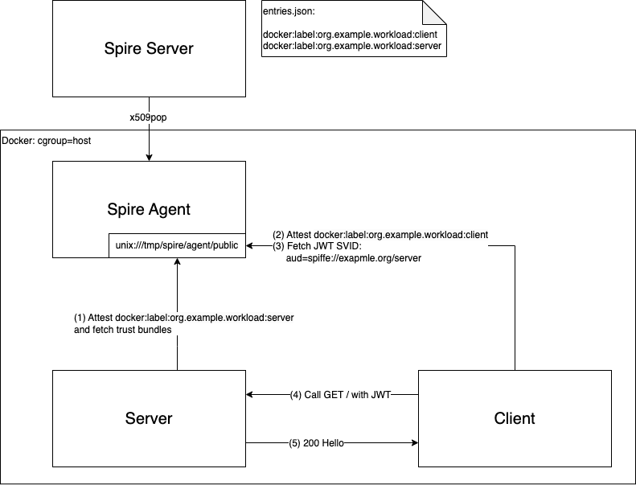

## ASP.NET Core - JWT SVID Sample

This sample demonstrates the use of [JWT-SVID](https://github.com/spiffe/spiffe/blob/main/standards/JWT-SVID.md) in ASP.NET Core project.

`Server` exposes endpoint protected by JWT Bearear authentication.
It fetches trust bundles from SPIRE Agent to validate caller's JWT token.

`Client` fetches JWT SVID from SPIRE Agent and keeps pinging `Server` with a JWT token derived from this SVID.



## Prerequisites

*   A running SPIRE server and agent. You can use the setup in the `samples/docker-spire` directory.
*   The trust domain configured in SPIRE must be `example.org`.
*   The following SPIRE registration entries are required. Replace placeholders like `<PARENT_ID_FOR_SERVER_AGENT>` and `<SELECTOR_FOR_SERVER>` with appropriate values for your SPIRE agent deployment. For example, if using Docker, a selector might be `docker:label:app:my-server`. Refer to the [SPIRE documentation on registration](https://spiffe.io/docs/latest/spire/using/registration/) for more details.

    ```bash
    # For the server (replace <PARENT_ID_FOR_SERVER_AGENT> and <SELECTOR_FOR_SERVER>)
    # Example selector for Docker: docker:label:app:my-server
    spire-server entry create \
        -spiffeID spiffe://example.org/my-server \
        -parentID <PARENT_ID_FOR_SERVER_AGENT> \
        -selector <SELECTOR_FOR_SERVER> \
        -dns my-server

    # For the client (replace <PARENT_ID_FOR_CLIENT_AGENT> and <SELECTOR_FOR_CLIENT>)
    # Example selector for Docker: docker:label:app:my-client
    spire-server entry create \
        -spiffeID spiffe://example.org/my-client \
        -parentID <PARENT_ID_FOR_CLIENT_AGENT> \
        -selector <SELECTOR_FOR_CLIENT>
    ```

## Running the Sample

You can run this sample using Docker Compose (recommended for ease of setup with SPIRE) or locally.

### Using Docker Compose

This method runs the sample applications along with a SPIRE server and agent.

1.  Navigate to the main `samples` directory:
    ```bash
    cd ../.. 
    # (Assuming you are currently in samples/Spiffe.Sample.AspNetCore.Jwt)
    # Or directly: cd <path_to_repo>/samples
    ```

2.  Set the `SAMPLE_DIR` environment variable to this sample's directory:
    ```bash
    export SAMPLE_DIR=Spiffe.Sample.AspNetCore.Jwt
    ```

3.  Run Docker Compose:
    ```bash
    docker-compose -f compose.yaml -p spiffe-aspnetcore-jwt up --build -d
    ```
    This will build the images and start the client, server, and SPIRE services in detached mode.

4.  To view logs:
    ```bash
    docker-compose -f compose.yaml -p spiffe-aspnetcore-jwt logs -f server client
    ```

5.  To stop and remove the services:
    ```bash
    docker-compose -f compose.yaml -p spiffe-aspnetcore-jwt down
    ```

### Running Locally (Example)

This method assumes you have a SPIRE agent running separately and its Workload API is accessible.

1.  **Ensure SPIRE Agent is Running**:
    *   The SPIRE agent must be running and configured.
    *   The `SPIFFE_ENDPOINT_SOCKET` environment variable must be set to point to your agent's Workload API socket.
        *   On Linux/macOS: `export SPIFFE_ENDPOINT_SOCKET=unix:///tmp/spire/agent/public/api.sock` (adjust path if necessary)
        *   On Windows: `set SPIFFE_ENDPOINT_SOCKET=npipe:////./pipe/spire-agent/public/api` (adjust path if necessary)

2.  **Run the Server:**
    *   Navigate to the server's directory:
        ```bash
        cd samples/Spiffe.Sample.AspNetCore.Jwt/Server
        ```
    *   Run the server application:
        ```bash
        dotnet run
        ```
    The server will start listening for requests, typically on `http://localhost:5000` or `https://localhost:5001`.

3.  **Run the Client:**
    *   Open a new terminal.
    *   Ensure `SPIFFE_ENDPOINT_SOCKET` is set as in step 1.
    *   Navigate to the client's directory:
        ```bash
        cd samples/Spiffe.Sample.AspNetCore.Jwt/Client
        ```
    *   Run the client application:
        ```bash
        dotnet run
        ```

## Expected Output

When running the sample, observe the logs from both the server and client applications.

### Server Logs

The server logs should indicate:
*   It has started and is listening for incoming connections.
*   It receives requests from the client.
*   It successfully validates the client's JWT-SVID and prints the client's SPIFFE ID.

Example snippet:
```
info: Microsoft.Hosting.Lifetime[0]
      Now listening on: http://localhost:5000
info: Microsoft.Hosting.Lifetime[0]
      Application started. Press Ctrl+C to shut down.
info: Spiffe.Sample.AspNetCore.Jwt.Server.Controllers.WeatherForecastController[0]
      Processing request from spiffe://example.org/my-client, Path: /WeatherForecast
```

### Client Logs

The client logs should show:
*   It successfully fetches a JWT-SVID from the SPIRE Workload API for its own SPIFFE ID (`spiffe://example.org/my-client`) with the server's SPIFFE ID (`spiffe://example.org/my-server`) as the audience.
*   It periodically sends requests to the server using the obtained JWT-SVID.
*   It receives successful responses from the server.

Example snippet:
```
info: Spiffe.Sample.AspNetCore.Jwt.Client.Worker[0]
      Fetching JWT SVID for spiffe://example.org/my-client with audience spiffe://example.org/my-server
info: Spiffe.Sample.AspNetCore.Jwt.Client.Worker[0]
      Calling server with JWT SVID: <JWT_TOKEN_CONTENT_SNIPPET>...
info: Spiffe.Sample.AspNetCore.Jwt.Client.Worker[0]
      Server response: Hello from spiffe://example.org/my-client! Processed by spiffe://example.org/my-server. Weather: ...
```
(Note: The actual JWT token in the client log will be a long string.)
