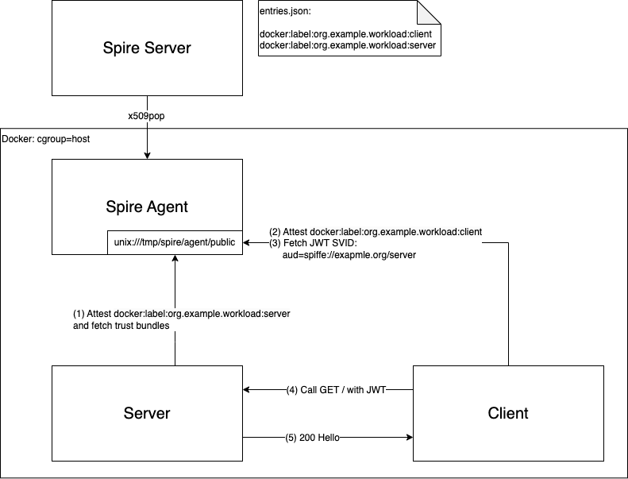

## ASP.NET Core - JWT SVID Sample

This sample demonstrates the use of [JWT-SVID](https://github.com/spiffe/spiffe/blob/main/standards/JWT-SVID.md) in ASP.NET Core project.

`Server` exposes endpoint protected by JWT Bearear authentication.
It fetches trust bundles from SPIRE Agent to validate caller's JWT token.

`Client` fetches JWT SVID from SPIRE Agent and keeps pinging `Server` with a JWT token derived from this SVID.

